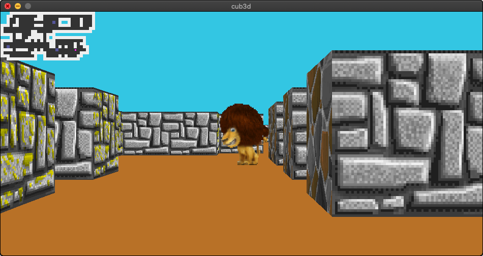

# cub3d
In this project I create a dynamic 3D view of the inside of a maze using Ray-casting. This project is inspired by the worlf-famous eponymous 90's game, which was the first FPS (Fist Person Shooter) ever [Wolfenstein 3D](http://users.atw.hu/wolf3d/).

## How to use it?
This project uses a tiny graphics library [MinilibX](https://harm-smits.github.io/42docs/libs/minilibx). Systems requirements are specify [here](https://github.com/42Paris/minilibx-linux).
  
At the root of the repository run the command
```bash
$ make cub3d
```
If failure for any missing dependencies, install them and re-run the command. Upon success, an executable file named **cub3d** will be created. Run the command  

```bash
# SYSNOPSIS:
# cub3d map [--save]

$ ./cub3d maps/map1.cub
```

the flag ```--save``` is the only flag available, it's used to save the first rendered image of the inside of the maze in a **bmp** file named ```screenshot.bmp```.<br>

Flag omitted, a window displaying the dynamic 3D projection of the maze will open
<div style="text-align:center"></div>  

Use the keyboard as follow to move inside the maze:  

<kbd>up</kbd> / <kbd>w</kbd> to move forward  
<kbd>down</kbd> / <kbd>s</kbd> to move backward  
<kbd>a</kbd> to move left  
<kbd>d</kbd> to move right  
<kbd>left</kbd>  to rotate left  
<kbd>right</kbd> to rotate right  
<kbd>esc</kbd> to cleanly close and exit the program.  

## Configurations

The files holding the configuration of the maze is located in the directory ```maps```.

```text
R 948 480
NO textures/wall_1.xpm
SO textures/wall_2.xpm
WE textures/wall_3.xpm
EA textures/wall_4.xpm
S textures/lion.xpm
F 184,113,39
C 51,198,227

   1111111111111111111111111111
  11000000001100000000000000001
  10010000011100000111100010001
  100100000000000201  100010001
1110110000011100000111100010001
1000000000000000000000000000011
100000000011000001111111111111
111101100011110111
   1011001111101 11111111111
1111000011010101110000000001
1000000000000000110000001011
10200000000000001101010010011
111101111001010000200000W0001
10000000001111100000000000111
111000000001  1000010100011
  1111111111  111111111111
``` 

